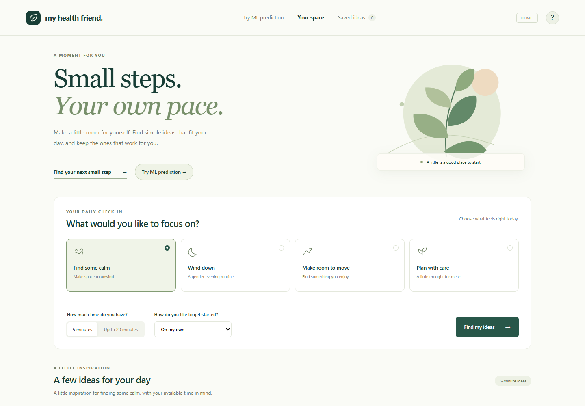
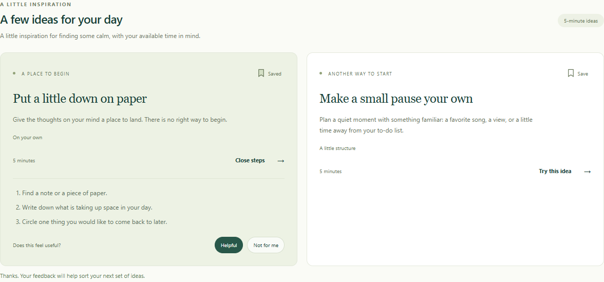
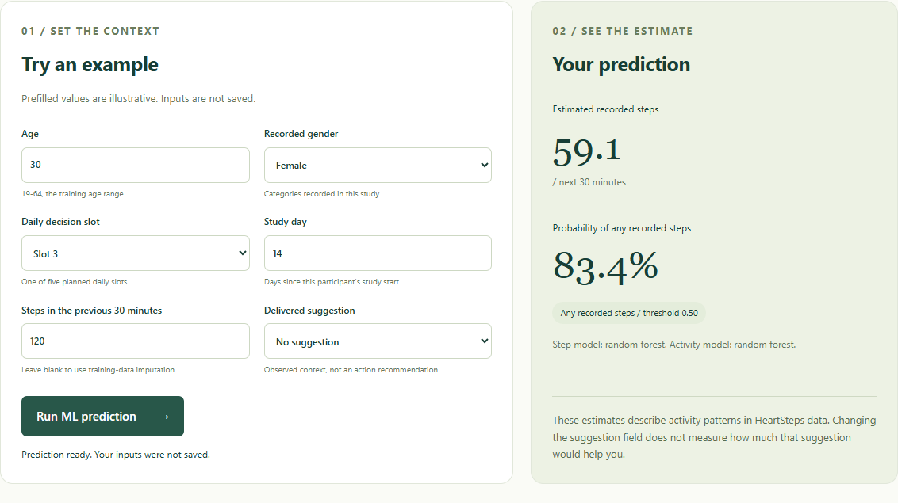
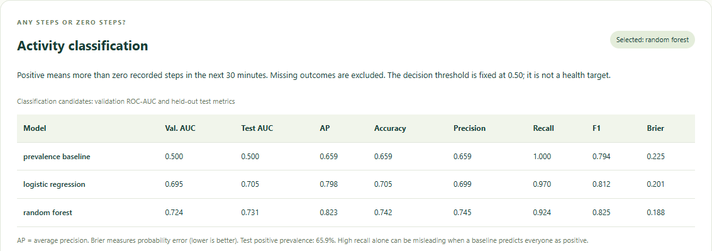
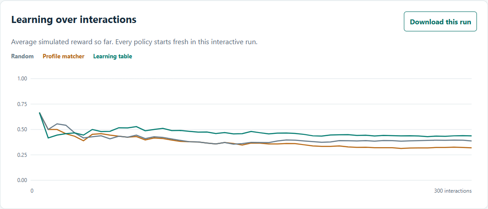
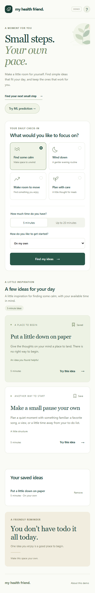
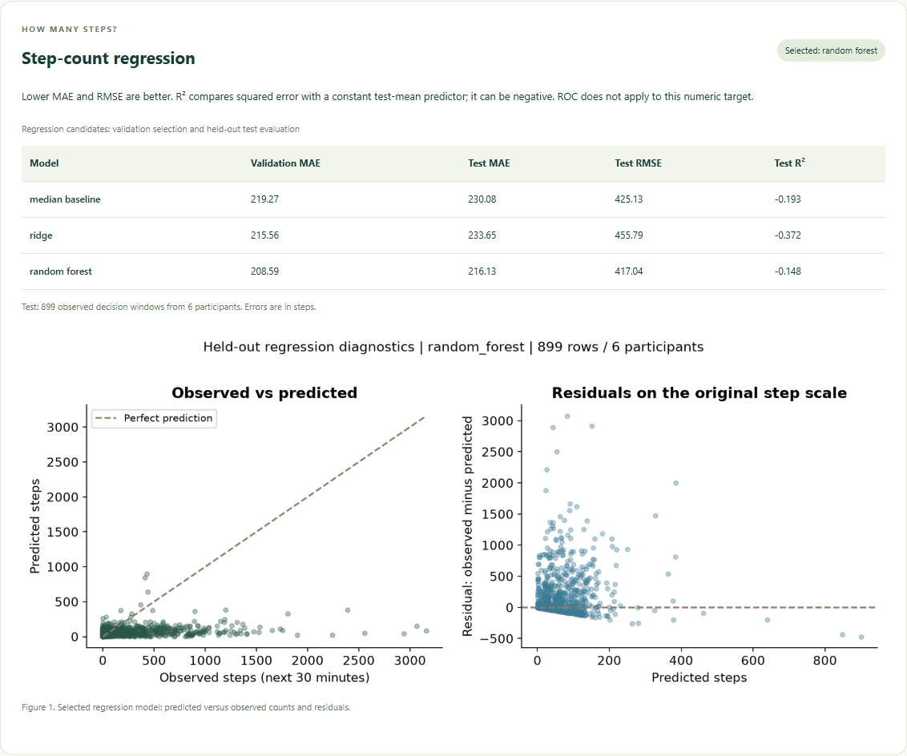
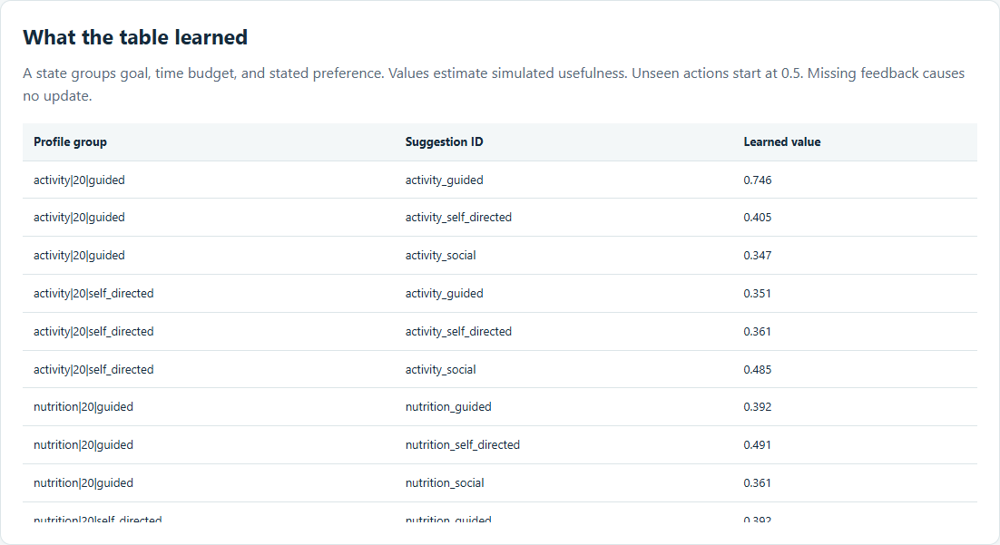
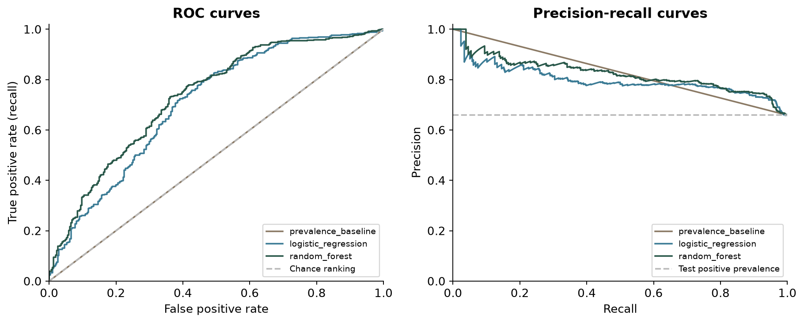

# My Health Friend

A personal wellness planning app with an interactive ML model explorer and a recommendation-learning lab.

Choose a focus, find ideas that fit your day, save favorites, and give feedback. Explore trained activity models or watch a Q-table respond to simulated feedback.

**Python 3.12 · Flask · scikit-learn · pandas · SQLite · Matplotlib**

[Quick start](#quick-start) · [Screenshots](#screenshots) · [Model results](#model-results) · [Project report](docs/report/MyHealthFriend_Updated_Report.pdf) · [Architecture](docs/ARCHITECTURE.md)



*Personal space: daily focus, available time, preferred style, and a direct entry to ML prediction.*

## Explore the product

| Experience | What you can do | Local route |
|---|---|---|
| Your space | Choose a goal, explore step-by-step ideas, save favorites and rate suggestions. | `/simulation` |
| ML prediction | Enter an example profile and run the saved step-count and activity classifiers. | `/predict` |
| Model evaluation | Compare models and inspect ROC, precision-recall, calibration and regression diagnostics. | `/predict#evaluation` |
| Learning lab | Run seeded feedback experiments, inspect Q-values and download results. | `/research` |
| Original questionnaire | Register, sign in, submit a questionnaire and view feedback-based recommendations. | `/` |

These experiences use different mechanisms. The personal space ranks authored ideas using preferences and browser-local feedback. The model explorer runs two trained supervised models. The learning lab uses a separate, explicitly synthetic contextual bandit. [Read how they connect](docs/ARCHITECTURE.md).

## Screenshots

### Suggestions and feedback



*Expand an idea, rate it, and save it. Ratings change the next ordering; saved ideas remain in the same browser after refresh.*

### Real model prediction



*Select **Try ML prediction**, then **Run ML prediction**. The example shown returns 59.1 estimated steps and an 83.4% probability of any recorded steps. These are outputs from separate trained models.*

### Classification evaluation



*Validation selects the model. The table reports performance on six separate held-out participants.*

### Q-table learning



*The interactive lab starts fresh on each run. Choose stable preferences, changing preferences, or missing feedback, then inspect how each policy behaves.*

<details>
<summary>More screenshots: mobile, regression and learned Q-values</summary>

#### Mobile personal space



#### Regression evaluation



#### Learned Q-values



</details>

[View the named screenshot index](docs/report/screenshots/README.md). Each image has a descriptive filename and a caption in the [18-page updated report](docs/report/MyHealthFriend_Updated_Report.pdf).

## Quick start

Use Python 3.12. The updated product is available on `main`.

```bash
git clone https://github.com/YASMINE712/patient-engagement-system.git
cd patient-engagement-system
```

### Windows / PowerShell

```powershell
py -3.12 -m venv .venv
.\.venv\Scripts\python.exe -m pip install -r requirements-lock.txt
.\.venv\Scripts\python.exe scripts/create_test_dataset.py
$env:SECRET_KEY = .\.venv\Scripts\python.exe -c "import secrets; print(secrets.token_hex(32))"
.\.venv\Scripts\python.exe run.py
```

### macOS / Linux

```bash
python3.12 -m venv .venv
source .venv/bin/activate
python -m pip install -r requirements-lock.txt
python scripts/create_test_dataset.py
export SECRET_KEY="$(python -c 'import secrets; print(secrets.token_hex(32))')"
python run.py
```

Open [your personal space](http://127.0.0.1:5000/simulation). The personal space and interactive learning lab work immediately. The fixture command creates labeled test content for the legacy questionnaire; it preserves any existing legacy CSV.

### Enable ML predictions

Train the models and generate their evaluation figures:

```powershell
.\.venv\Scripts\python.exe scripts/run_pipeline.py --download
```

On macOS/Linux, use `python scripts/run_pipeline.py --download` in the activated environment. The command verifies pinned HeartSteps files, runs ETL, trains and evaluates both supervised tasks, and runs the full synthetic benchmark. Cached runs can omit `--download`.

Open [the prediction page](http://127.0.0.1:5000/predict), enter the example values, and select **Run ML prediction**. Inputs are not saved. Scroll to **Model evaluation** for the results. Without trained artifacts, the page shows a setup message instead of inventing predictions.

## Model results

HeartSteps V1 provides **8,274 decisions from 37 participants**. The pipeline identifies **5,800 eligible observed outcome rows**, split into **3,938 training / 963 validation / 899 test** rows from **25 / 6 / 6 separate people**. Preprocessing is fitted on training data only.

| Task | Validation-selected model | Held-out results | Reference |
|---|---|---|---|
| Next 30-minute step count | Random Forest regressor | MAE **216.13 steps**; RMSE **417.04**; R2 **-0.148** | Median baseline MAE: 230.08 steps |
| Any recorded steps in the next 30 minutes | Random Forest classifier | ROC-AUC **0.731**; AP **0.823**; F1 **0.825**; accuracy **74.2%** | Prevalence baseline ROC-AUC: 0.500 |
| Synthetic usefulness, stable preferences with online updates | Tabular contextual bandit | Mean simulated reward **0.4133** across five seeds | Profile matcher: 0.3841; random: 0.4176 |

The regressor improves MAE but still has negative R2 and underpredicts large counts. The bandit does not consistently beat random selection. Only six test participants support the supervised results. These limitations remain visible in the reports.



*ROC and precision-recall belong to the binary classifier. Numeric step prediction uses regression metrics. Any recorded steps is not a label for health improvement.*

- [Regression comparison and limitations](docs/results/HEARTSTEPS_MODEL.md)
- [Classification metrics](docs/results/HEARTSTEPS_CLASSIFIER.md)
- [Synthetic benchmark](docs/results/SIMULATION_BENCHMARK.md)
- [Data quality and missingness](docs/results/DATA_QUALITY.md)
- [Full model and simulator card](docs/MODEL_CARD.md)

## Data and learning pipeline

```text
Pinned HeartSteps data                 Seeded fictional users
        |                                      |
Hash and schema validation             Goal / time eligibility
        |                                      |
Participant-separated splits           Random / matcher / bandit
        |                                      |
Train-fitted preprocessing             Simulated feedback
        |                                      |
Regression + classification            Immediate Q-value updates
        |                                      |
Held-out metrics and figures           Five-seed benchmark
        |                                      |
Saved-model prediction page            Interactive learning lab
```

Missing outcomes remain missing; they are not converted into inactivity. Synthetic feedback is kept separate from observed records. No fabricated labels or outcome augmentation are used. The Q-table estimates immediate usefulness, with no simulated health-state transitions. Random Forest retraining is an explicit pipeline run, not a side effect of clicking Helpful.

## Project structure

```text
health_friend/
  web.py                  Legacy account and questionnaire routes
  prediction.py           Saved-model inference API and explorer
  recommendations.py      Legacy deterministic recommendation logic
  data_pipeline/          Ingestion, ETL, training and evaluation plots
  simulation/             Synthetic environment, policies and benchmark
  templates/              Personal space, prediction and research pages
  static/                 CSS and JavaScript
scripts/                  Fixture and full-pipeline commands
tests/                    Application, ETL, inference and policy tests
data/sources/             Pinned source manifest
docs/report/              Updated report, screenshots and figures
docs/results/             Measured experiment snapshots
```

## Tests and reproducibility

```powershell
.\.venv\Scripts\python.exe -m unittest discover -s tests -v
```

**42 local tests pass**, including input validation, participant isolation, missing-data handling, saved-model inference and Q-table updates. Desktop/mobile browser checks cover prediction, saving ideas, feedback, chart rendering and research exports. [Verification record](docs/VERIFICATION.md).

GitHub Actions runs the portable tests and a small simulation check. A quick benchmark is a software check and overwrites generated simulation reports; use the full pipeline for final experiment figures. Docker configuration is included but has not been verified on the development host.

## Documentation and project history

- [Updated report: PDF](docs/report/MyHealthFriend_Updated_Report.pdf) / [editable text](docs/report/MyHealthFriend_Updated_Report.md)
- [Architecture](docs/ARCHITECTURE.md)
- [ETL contract, source attribution and exclusions](docs/DATA_CONTRACT.md)
- [Reproduction and Docker instructions](docs/REPRODUCIBILITY.md)
- [Implementation status](docs/ROADMAP.md)
- [Migration from the original repository](docs/REPOSITORY_MIGRATION.md)

This update keeps the original repository history while replacing the tracked Python environment and duplicate files with a modular source tree. Original contributors: **Yassine Yasmine, Kassraoui Mohammed, Oumam Anass and El Mir Saad**.

HeartSteps V1 data: [klasnja/HeartStepsV1](https://github.com/klasnja/HeartStepsV1), CC-BY-4.0. The data contract documents attribution and transformations. The inherited app code has no new repository-wide license assigned by this update.

## Configuration

`SECRET_KEY` signs sessions; use a private persistent value across restarts. `DATABASE_URL` defaults to `instance/users.db`. `Q_TABLE_PATH` configures the legacy scores. `.env.example` documents the settings and is not automatically loaded.

This is a local portfolio prototype. The legacy account forms still need a production security review and CSRF protection. No clinical effectiveness, automatic production model promotion or scheduled retraining is claimed. Raw datasets, private exports, databases, environments and trained artifacts are excluded from version control.
