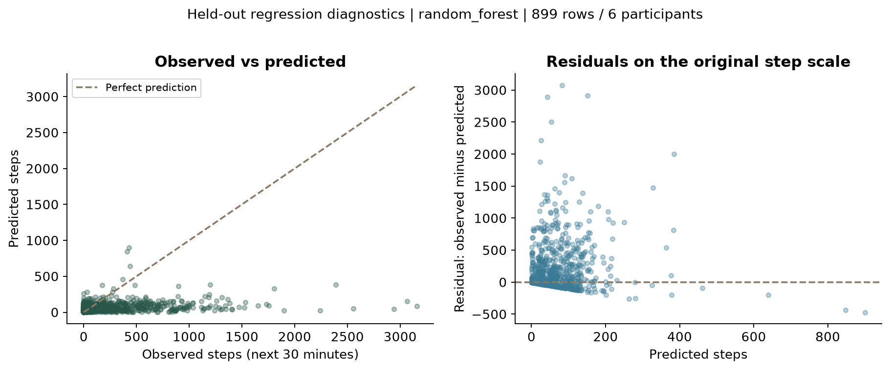
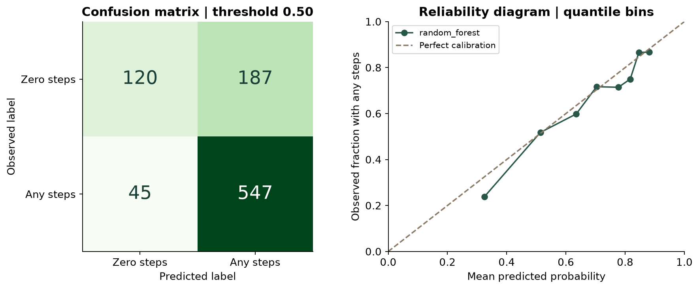

UNIVERSITE MOHAMMED VI DES SCIENCES ET DE LA SANTE

Ecole Superieure Mohammed VI d'Ingenieurs en Sciences de la Sante

My Health Friend

Personalized engagement, activity prediction and recommendation-learning experiments

Revised implementation and evaluation report

2e annee - Genie Digital en Sante

> A reproducible portfolio project connecting a user-facing Flask interface, audited HeartSteps data, supervised models, and a separate synthetic contextual-bandit experiment.

Original project team

Mme. Yassine Yasmine M. Oumam Anass M. Kassraoui Mohammed M. El Mir Saad

Original project supervisor

Mme. BEN BOUAZZA Fatima Ezzahraa

Credits preserved from the supplied MyHealthFriend2.pdf. This revision documents the current local implementation and replaces unsupported claims in the earlier report.

UPDATED PROJECT REPORT / 02

What changed, and what works

The project now separates four experiences: a friendly planning interface, supervised activity prediction, a synthetic learning lab, and the retained legacy account/questionnaire application. They share a Flask codebase, but they do not share a single learning mechanism.

| Measured result | Current evidence |
| --- | --- |
| Observed-data regression | Random Forest selected by validation MAE. Test MAE 216.13 steps; RMSE 417.04; R2 -0.148. |
| Observed-data classification | Any recorded steps (>0). Test ROC-AUC 0.731; F1 0.825; accuracy 74.2%. |
| Evaluation population | 3,938 training, 963 validation and 899 test decision windows; 25 / 6 / 6 separate participants. |
| Software verification | 42 automated tests passed. Browser checks cover real inference, missing inputs, navigation, figures, mobile layout and research export. |

> To test the ML: open http://127.0.0.1:5000/predict, or click <b>Try ML prediction</b> from the personal space. Select <b>Run ML prediction</b>. Scroll down to <b>Model evaluation</b> for the measured results.

Report guide

| Pages | Contents |
| --- | --- |
| 3-5 | Scope, architecture, ETL and supervised model protocol |
| 6-8 | Regression results, classifier metrics and evaluation curves |
| 9 | Q-table method and benchmark results |
| 10-13 | User interface, prediction and evaluation screenshots |
| 14 | Learning curves and learned Q-values |
| 15-16 | Verification, reproduction, limitations and future work |
| 17-18 | Named screenshot index, references and revision record |

UPDATED PROJECT REPORT / 03

Objectives and system scope

The original goal was a personalized patient-engagement application. The revised deliverable makes that goal testable as a software and ML portfolio project: deterministic suggestions, explicit feedback, reproducible data processing, separate predictive tasks and measured learning behavior.

| Component | Implemented behavior | Learning or storage |
| --- | --- | --- |
| Personal space /simulation | Choose stress, sleep, activity or nutrition; time budget; style; save an idea and rate usefulness. | Authored catalog; browser-local saved IDs and ratings; deterministic ranking. |
| Model explorer /predict | Try context values and receive next-window step and activity-probability estimates. | Two offline-trained scikit-learn pipelines; read-only inference; inputs not saved. |
| Learning lab /research | Run a seeded scenario; inspect reward curves and Q-values; export run JSON. | Fictional users and immediate-reward table updates; each interactive run starts fresh. |
| Legacy routes /, /signup, /login, /questionnaire | Account creation, authentication, validated questionnaire submission and feedback. | SQLite accounts/questionnaires; a separate legacy recommendation table. |

Functional and implementation requirements

The implementation uses Python 3.12, Flask, SQLAlchemy, pandas, NumPy, scikit-learn, joblib, Matplotlib, HTML, CSS and JavaScript. It does not use TensorFlow or PyTorch. The frontend requires no external image or font service.

Passwords are hashed and records are scoped to the signed-in user. Prediction requests validate allowed fields and finite numeric ranges. Raw datasets, local databases, secrets and fitted model files are excluded from the source archive. These controls do not constitute a production security certification.

Claims kept outside the implemented scope

No clinical efficacy study, verified health improvement, wearable integration, automatic production model promotion, or measured sub-second service-level guarantee is claimed. The source includes Docker and CI configuration; Docker is untested on this host and hosted CI has not run.

UPDATED PROJECT REPORT / 04

Data sources and ETL

The real-data experiment uses HeartSteps V1 [1], pinned to commit 3016391de426116bdef41880d72bc8cd4b9b2477. The source manifest records URLs, byte counts and SHA-256 hashes. Downloaded users and suggestions tables are kept separately from generated demo interactions.

| Stage | Records / decision |
| --- | --- |
| Raw joined decisions | 8,274 decision records from 37 participants |
| Eligible decisions | 6,589: available, known delivered action, and usable timestamps |
| Observed eligible outcomes | 5,800: eligible rows with a recorded next-window step count |
| Train / validation / test | 3,938 / 963 / 899 modeled rows; 25 / 6 / 6 participants |
| Outcome missingness | 1,041 missing post-window counts across the full decision table; never replaced with zero |
| Previous-step missingness | 1,012 missing pre-window counts across the full decision table; modeled inputs use train-fitted imputation |

Extraction and validation

The ETL verifies source hashes, validates unique user and decision keys, joins many-to-one on participant ID, checks categorical/numeric fields, and rejects orphan joins or future context. Full audit records are retained. The feature and label exports share join keys and explicit eligibility flags.

Transformations and split protection

Age, recorded gender, planned slot, study day and previous-window steps form the profile/history allowlist; delivered action is added deliberately for outcome prediction. Participant IDs, responses and future outcomes are not features. A deterministic participant hash split with seed 2026 keeps each person entirely in one partition.

Missing numeric inputs use training medians with missingness indicators; categories use a training-fitted mode and one-hot encoding. Unknown categories are handled by the encoder. Source timezone and pre-window dictionary inconsistencies remain documented in DATA_CONTRACT.md. Temperature and ambiguous timezone offsets are excluded.

Legacy and synthetic sources

The original 374-row CSV has 132 distinct profiles and inconsistent advice for some repeated profiles. Its provenance and redistribution rights are unresolved, so it remains a legacy source. The simulator creates separately labeled fictional users and feedback; it does not augment HeartSteps outcomes.

UPDATED PROJECT REPORT / 05

Supervised models and evaluation protocol

| Task | Target | Candidates and selection |
| --- | --- | --- |
| Regression | log1p(next 30-minute steps); predictions transformed back and clipped at zero. | Median baseline; Ridge alpha=1; Random Forest. Select minimum validation MAE in steps. |
| Classification | 1 if observed next-window steps >0; otherwise 0. Missing counts are excluded. | Prior-probability baseline; logistic regression C=1; Random Forest. Select maximum validation ROC-AUC. |

The two Random Forests have 150 trees, maximum depth 8, minimum leaf size 10, random seed 2026, and one fitting worker. The classifier and regressor are independently fitted artifacts. A shared preprocessing design is fitted separately inside each candidate pipeline.

Leakage and model-selection controls

All candidate settings are specified before fitting. Training participants fit preprocessing and models; validation participants select a candidate. The test set is used to report all fixed candidates after selection, without hyperparameter or threshold retuning. Classification uses a fixed 0.50 probability threshold. This is a single participant holdout, not cross-validation or a prospective temporal trial.

Why ROC appears only for classification

Step counts are numeric, so regression is assessed with MAE, RMSE, R2 and residual plots. ROC-AUC measures ranking of a binary outcome across thresholds. Precision-recall curves and average precision provide a second view of the classifier; Brier score and calibration assess its probability estimates [2].

Added endpoint and uncertainty

The binary endpoint is an added portfolio task: any recorded steps, not a diagnosis, useful recommendation, or improvement in health. It is simpler than predicting a count. The test split has 592 positive and 307 zero-step records. The exploratory ROC-AUC interval resamples the six entire test participants, with replacement, 1,000 times using seed 2026.

> There is no artificial label augmentation or oversampling. Repeated decision windows cannot be counted as independent participants. Since the test results are now visible, future model development needs a newly reserved evaluation protocol.

UPDATED PROJECT REPORT / 06

Regression: measured performance

| Candidate | Val. MAE | Test MAE | Test RMSE | Test R2 |
| --- | --- | --- | --- | --- |
| median baseline | 219.27 | 230.08 | 425.13 | -0.193 |
| ridge | 215.56 | 233.65 | 455.79 | -0.372 |
| random forest | 208.59 | 216.13 | 417.04 | -0.148 |

Random Forest was selected using validation MAE (208.59). Its held-out MAE is 6.1% below the median baseline. Its test log1p RMSE is 2.434. All test figures use 899 decision windows from six participants.

Interpretation

MAE improves modestly, but R2 remains negative. Under squared-error evaluation on the original step scale, this model is worse than predicting the test-set mean. The plotted residuals reveal underprediction of larger activity counts. Log-space fitting and MAE-based selection do not optimize original-scale squared error.

These results support an honest baseline demonstration, not a claim of accurate individual health forecasting. There is no patient-specific prediction interval. New targets or estimators should be evaluated under a fresh protocol rather than selected by repeated use of these test results.

UPDATED PROJECT REPORT / 07

Classification: ROC and decision metrics

| Candidate | Val. AUC | Test AUC | Test AP | Accuracy |
| --- | --- | --- | --- | --- |
| prevalence baseline | 0.500 | 0.500 | 0.659 | 0.659 |
| logistic regression | 0.695 | 0.705 | 0.798 | 0.705 |
| random forest | 0.724 | 0.731 | 0.823 | 0.742 |

| Candidate | Precision | Recall | F1 | Brier |
| --- | --- | --- | --- | --- |
| prevalence baseline | 0.659 | 1.000 | 0.794 | 0.225 |
| logistic regression | 0.699 | 0.970 | 0.812 | 0.201 |
| random forest | 0.745 | 0.924 | 0.825 | 0.188 |

The validation-selected Random Forest reaches test balanced accuracy 0.657 and log loss 0.561. Test positive prevalence is 65.9%. The prevalence baseline predicts the positive class for everyone, so its perfect recall is not evidence of a useful classifier.

Confusion matrix at probability threshold 0.50

| Observed / predicted | Zero steps | Any steps |
| --- | --- | --- |
| Zero recorded steps | 120 | 187 |
| Any recorded steps | 45 | 547 |

This gives 120 true negatives, 187 false positives, 45 false negatives and 547 true positives. The threshold favors recall over specificity. It was fixed before training; no clinical cost model or optimal decision threshold is implied.

Uncertainty and interpretation

The exploratory 95% participant-bootstrap ROC-AUC interval is 0.685-0.764. All 1,000 resamples contained both classes. Six held-out people are too few to establish broad population performance. The classification and regression targets differ, so their scores cannot be compared as if one model were globally better.

UPDATED PROJECT REPORT / 08

Classification curves and calibration

The selected forest separates positive and zero-step windows better than the constant baseline. Precision-recall plots make the prevalence reference visible; a high positive fraction can make accuracy and F1 look stronger than the ranking performance alone suggests.

The reliability diagram compares average probabilities with observed proportions in each bin. It is a diagnostic, not a calibration procedure: no additional calibrator was fitted. Bin variation and the small number of participants limit interpretation. Brier score is 0.188, compared with 0.225 for the prevalence baseline.

UPDATED PROJECT REPORT / 09

Q-table learning remains a separate task

A contextual bandit learns immediate usefulness from fictional feedback. Its state combines goal, time budget and stated format preference. Twelve catalog actions cover four goals and three interaction formats; eligibility filters goal and time. Hidden response preferences and fatigue are available to the simulator, not to the learner.

> <b>Update rule:</b> Q(state, action) = Q(state, action) + alpha x [feedback - Q(state, action)]. Initial values = 0.5; training epsilon = 0.1; gamma = 0. Missing feedback skips the update.

Alpha is chosen from 0.05 and 0.15 using a separate simulated validation population. The full benchmark uses seeds 11, 22, 33, 44 and 55, 8,000 training interactions and 2,000 evaluation interactions per run. Frozen evaluation disables updates; online adaptation predicts before observing each new response.

| Scenario | Policy | Mean reward | Seed SD |
| --- | --- | --- | --- |
| stationary | random | 0.4176 | 0.0222 |
| stationary | profile matcher | 0.3841 | 0.0229 |
| stationary | tabular bandit | 0.4133 | 0.0254 |
| preference shift | random | 0.4263 | 0.0179 |
| preference shift | profile matcher | 0.3165 | 0.0186 |
| preference shift | tabular bandit | 0.4112 | 0.0158 |
| high nonresponse | random | 0.4176 | 0.0222 |
| high nonresponse | profile matcher | 0.3841 | 0.0229 |
| high nonresponse | tabular bandit | 0.3997 | 0.0187 |

In stable preferences, the frozen bandit mean reward is 0.3255, compared with 0.4176 for random. Online adaptation raises the bandit to 0.4133, still below random. Its coarse state does not include repetition history, which limits performance under fatigue. Random selection can avoid repeated actions better in this simulator.

These are simulated utility results, not health outcomes. They neither validate the supervised models nor train them. The browser-local helpful/not-for-me score in the personal space is also separate from this Q-table.

UPDATED PROJECT REPORT / 10

The user-facing personal space

The redesigned page focuses on a daily check-in, four goals, a time budget and a preferred style. Technical experiment details are accessible through the research page rather than a large warning banner in the main flow. A small Demo label and an About panel explain the sample experience.

What the suggestions actually do

The catalog has authored sample planning ideas. A goal/time filter chooses eligible content; a style match adds 0.3 to the ranking score. Helpful feedback adds 0.7 and not-for-me feedback subtracts 0.7. Stable IDs break ties. The top two eligible items are displayed, with no random choice.

Saved IDs and ratings persist in localStorage in this browser, not in the study data or model artifacts. A reset is available in About this demo. The responsive version uses the same controls and keeps a visible ML entry point on mobile.

UPDATED PROJECT REPORT / 11

Suggestions, steps and saved feedback

Interaction sequence

1. Choose a focus, the available time and a preferred format. 2. Select <b>Find my ideas</b> to apply the choices. 3. Select <b>Try this idea</b> to expand its steps. 4. Choose <b>Helpful</b> or <b>Not for me</b>; the next request uses that rating to reorder ideas. 5. Select <b>Save</b> to keep an item, or remove it from the saved list.

Persistence and boundaries

Browser tests verified that saved ideas survive refresh and that negative feedback changes the next ordering. These ratings do not update a Random Forest, create health outcome labels, or automatically train the research Q-table. Clearing this browser storage removes the local personalization.

UPDATED PROJECT REPORT / 12

How to test a real ML prediction

From the personal space, click <b>Try ML prediction</b>. The direct address is <link href="http://127.0.0.1:5000/predict" color="#285749">http://127.0.0.1:5000/predict</link>. Choose the context and click <b>Run ML prediction</b>. A missing model produces a setup message; it never falls back to a fabricated prediction.

| Example input | Value |
| --- | --- |
| Age / recorded gender | 30 / female |
| Slot / study day | 3 / 14 |
| Previous 30-minute steps / delivered action | 120 / no suggestion |

The captured run estimates <b>59.1 steps</b> and <b>83.4% probability of any recorded steps</b> in the next 30-minute window. These are different outputs from separately fitted models. The displayed binary label uses threshold 0.50.

Blank previous-window steps use the saved training imputer; other required numeric fields use finite integer bounds matching training support. The API loads fixed local artifact names, not uploads. Inputs are not stored. Changing the delivered-action input is a conditional prediction exercise, not proof of the action's causal benefit.

UPDATED PROJECT REPORT / 13

Evaluation inside the application

Scroll below the prediction form, or select <b>View model evaluation</b>. The page reads the generated reports and serves only an allowlist of evaluation images. It also displays ROC/PR curves, the selected confusion matrix and reliability diagram.

UPDATED PROJECT REPORT / 14

Inspecting the learning experiment

Click <b>Learning lab</b> from the model explorer, choose a scenario, and select <b>Run experiment</b>. Select <b>Download this run</b> for the labeled JSON result. These short curves are separate from the five-seed benchmark on page 9.

UPDATED PROJECT REPORT / 15

Verification and reproduction

| Check | Evidence from this revision |
| --- | --- |
| Automated tests | 42 passed: app isolation and feedback; ETL validation and leakage checks; training transforms; simulator updates; inference from saved artifacts; invalid inputs and absent artifacts. |
| Browser behavior | Microsoft Edge headless, desktop and 390-pixel mobile viewport: ML navigation, actual inference, missing-value inference, loaded figures, no horizontal page overflow, Q-table charts and JSON export. |
| Data and model pipeline | The complete cached-source ETL, regression, classification and five-seed simulation pipeline completed successfully. Report hashes were written to pipeline_run.json. |
| Environment | Python 3.12; scikit-learn 1.7.2; versions pinned in requirements-lock.txt; pip check passed. |
| Isolation | Tests use temporary SQLite databases and temporary Q-table paths, separate from the local account database. |
| Not verified | Docker build/runtime and hosted GitHub CI. No production load test or prospective clinical study. |

Run from the project root in PowerShell

py -3.12 -m venv .venv .\.venv\Scripts\python.exe -m pip install -r requirements-lock.txt .\.venv\Scripts\python.exe scripts/create_test_dataset.py .\.venv\Scripts\python.exe scripts/run_pipeline.py --download .\.venv\Scripts\python.exe run.py

The fixture command is for fresh source copies without the private legacy CSV. It does not overwrite an existing dataset. The first full pipeline run downloads pinned sources; later cached runs can omit --download. Read README.md for secret-key setup and limitations.

Tests and generated outputs

.\.venv\Scripts\python.exe -m unittest discover -s tests -v

Models are written under artifacts/; experiment JSON, Markdown and PNG figures under reports/generated/. Sources and tests are shareable; raw records, environment directories, account databases and generated models are not bundled in the source archive. Prediction does not retrain models.

UPDATED PROJECT REPORT / 16

Limitations and next development steps

What the evidence supports

The project demonstrates reproducible ETL, participant-aware validation, baseline comparison, supervised inference, probability evaluation, immediate-feedback bandits, and an integrated Flask interface. It does not establish that the displayed planning ideas improve sleep, stress, diet or activity.

Limits that affect interpretation

Only six held-out test participants support the reported scores. Sensor counts can be missing or imperfect. Delivered action is observed context, not a reconciled assignment probability. The step-count model underpredicts large counts and has negative R2. The binary classifier predicts any recorded movement, not adherence or recommendation usefulness. Test-set visibility limits further unbiased iteration.

The simulator uses assumed preference and fatigue mechanisms. Coarse Q-table states miss individual and historical variation, and the learning table does not consistently outperform random selection. The personal-space ranking is an explicit browser-local heuristic. None of these mechanisms is silently substituted for another.

Prioritized future work

| Priority | Planned work and acceptance evidence |
| --- | --- |
| 1 | Reserve a new evaluation protocol before tuning: participant-group validation and a clearly separated final holdout. |
| 2 | Compare count-aware or two-stage models, inspecting both MAE and large-count errors; investigate calibration on validation data only. |
| 3 | Add action-history features to the bandit and evaluate repetition/diversity under the same seeded scenarios. |
| 4 | Collect consented, task-specific real feedback before linking recommendations to real outcomes; reconcile assignment/delivery records before causal or off-policy analysis. |
| 5 | Add production security review, deployment verification, monitoring and rollback before any public operational use. |

Portfolio description supported by this build

> Developed a Flask ML prototype with audited HeartSteps ETL, participant-separated regression and classification evaluation, a saved-model prediction interface, and a separately labeled contextual-bandit simulator. Added automated tests and reproducible experiment reports.

UPDATED PROJECT REPORT / 17

Named screenshots and figure index

Screenshots are actual captures of this revision using an isolated browser-test database and illustrative inputs. Their descriptive filenames identify what was captured. No personal account records are included.

| Screenshot filename | What it shows | Report location |
| --- | --- | --- |
| 01_Personal_space_desktop.png | Desktop daily check-in and the ML navigation entry. | Fig. 4 / p. 10 |
| 02_Suggestions_and_feedback.png | Expanded suggestion steps, Helpful feedback and Save control. | Fig. 5 / p. 11 |
| 03_ML_prediction_inputs_and_results.png | Six model inputs and both saved-model prediction outputs. | Fig. 6 / p. 12 |
| 04_Regression_evaluation.png | Regression model table and prediction/residual diagnostics. | Fig. 7 / p. 13 |
| 05_Classification_metrics.png | Classification candidate comparison and metric definitions. | Fig. 8 / p. 13 |
| 06_Q_table_learning_curves.png | Cumulative simulated reward for the three interactive policies. | Fig. 9 / p. 14 |
| 07_Learned_Q_values.png | Learned state/action values from the same short run. | Fig. 10 / p. 14 |
| 08_Personal_space_mobile.png | Full mobile personal space at 390 x 844 viewport. | Screenshot package |

Generated scientific figures

| Figure file | Report location |
| --- | --- |
| regression_diagnostics.png | Figure 1 / page 6 |
| classification_roc_pr.png | Figure 2 / page 8 |
| classification_confusion_calibration.png | Figure 3 / page 8 |

The screenshots/ and evaluation_figures/ folders are included together in MyHealthFriend_Screenshots_and_Evaluation.zip, with a README index. Original-size PNGs are provided so that small table text can be inspected without relying on the reduced report images.

UPDATED PROJECT REPORT / 18

References and revision record

Sources

[1] Klasnja and collaborators. HeartSteps V1 data repository. Pinned revision 3016391de426116bdef41880d72bc8cd4b9b2477; CC-BY-4.0. This project transforms the users and suggestions tables. <link href="https://github.com/klasnja/HeartStepsV1" color="#285749">https://github.com/klasnja/HeartStepsV1</link>

[2] Scikit-learn 1.7.2 documentation. Metrics and scoring: quantifying the quality of predictions. Used for metric definitions and implementation references. <link href="https://scikit-learn.org/1.7/modules/model_evaluation.html" color="#285749">https://scikit-learn.org/1.7/modules/model_evaluation.html</link>

[3] Supplied project document, MyHealthFriend2.pdf, 20 pages. Source for the original project identity, credits and legacy description; its unsupported performance and outcome claims have not been retained as results.

[4] Local generated evidence: data_quality.json, heartsteps_model.json, heartsteps_classifier.json, simulation_benchmark.json and pipeline_run.json. Source definitions: data/sources/heartsteps-v1.json. Detailed assumptions: docs/DATA_CONTRACT.md and docs/MODEL_CARD.md.

Changes from the supplied report

| Earlier description | Revised account |
| --- | --- |
| TensorFlow or PyTorch RL stack | Actual Flask/scikit-learn/tabular-bandit implementation. |
| 374 rows as sufficient RL training evidence | Legacy provenance audit plus separately pinned HeartSteps and labeled synthetic experiments. |
| General Q-learning over health-state transitions | Immediate-reward contextual bandit; no fabricated health transitions. |
| High accuracy and continuously improving health outcomes | Measured candidate metrics, negative R2, baseline failures and explicit evaluation limits. |
| Old interface captures and broken figure references | Named current screenshots, new ML inference screen, fresh plots and a complete figure index. |

Conclusion

My Health Friend now provides a concrete, testable ML portfolio implementation. Users can try real saved-model inference, reviewers can inspect held-out evaluation, and the separate simulator makes feedback learning visible. The report reflects the current software and measured results, including where the baselines remain weak.
